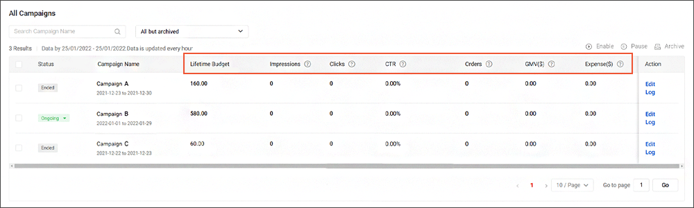

# 优化 Facebook Ads 广告活动

> **来源：** https://ads.shopee.com.my/learn/faq/229/995
> **分类：** Facebook Ads

要评估和改善 Facebook Ads 广告活动的表现，请在 **All Campaigns（全部广告活动）** 下监控并分析以下指标：

**1. Impressions（展示量）**

展示量衡量您的广告向消费者展示的次数。如果广告投放了较长时间但展示量仍然很低，建议提高每日广告预算以获取更大的触达范围。

**2. Clicks（点击量）和 Click-through Rate / CTR（点击率）**

点击量是指广告被点击的次数，CTR 则是广告总点击量除以总展示量得出的比率。要提升点击量和 CTR，请优化商品列表的质量，尤其是商品图片。

**3. Orders（订单量）**

指通过广告产生的订单总数。

**4. Gross Merchandise Value / GMV（总商品交易额）**

衡量消费者点击广告后 7 天内所售出商品的总价值。

详细设置指南请参阅此[页面](https://seller.shopee.com.my/edu/article/12056/facebook-ads)。