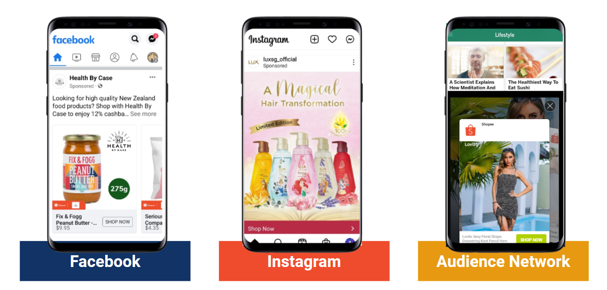

# 使用 Facebook Ads 推广您的商品

> **来源：** https://ads.shopee.com.my/learn/faq/229/998
> **分类：** Facebook Ads

当消费者浏览 Facebook、Instagram 以及 Audience Network 中的各类网站时，将您的商品触达具有高购买意向的人群。广告中展示的商品会根据消费者的兴趣进行个性化匹配。点击广告后，消费者将被引导至您的 Shopee 商品详情页。

## Facebook Ads 会在哪里展示？

