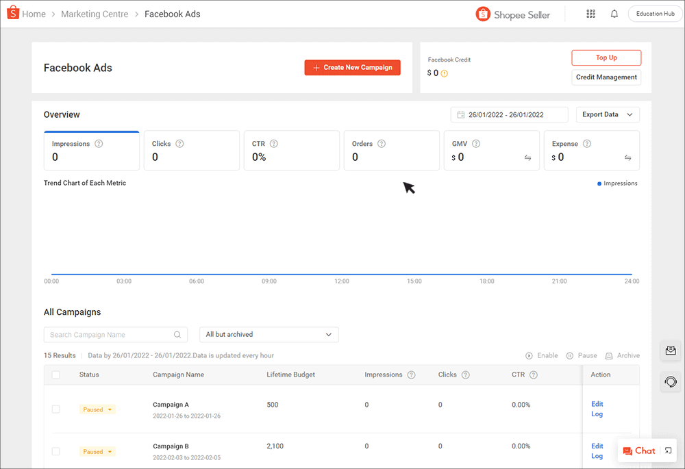
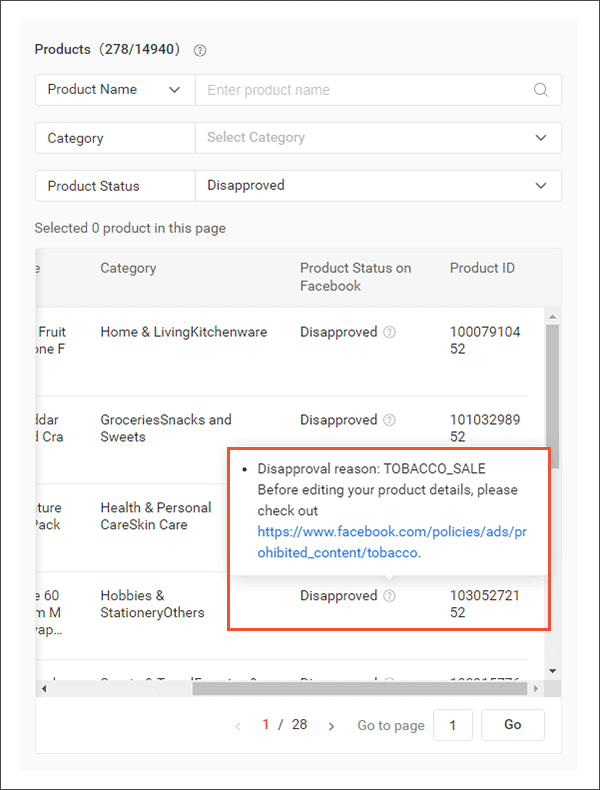

# 创建 Facebook Ads 广告活动

> **来源：** https://ads.shopee.com.my/learn/faq/229/996
> **分类：** Facebook Ads

您可以根据自己的目标和需求，灵活设定每个广告活动的预算和投放周期。您可以为店铺中不同的商品分类创建多个 Facebook Ads 广告活动。

## 如何创建广告活动？

充值广告金后，即可开始创建广告活动。

## 推荐的广告活动设置

- **总预算（Lifetime Budget）：** 建议每日最低预算从 RM60 起步。
- **开始与结束日期：** 建议 Facebook Ads 至少投放 7 天，给予系统足够时间优化广告表现。

## 如何向广告活动添加商品？

系统将以轮播形式在消费者信息流中展示 10 件不同的商品。Facebook 会根据消费者的偏好和行为自动选择展示的商品。您也可以选择在 Facebook Ads 广告活动中最少展示 5 件商品。

Facebook Ads 广告活动无需额外上传图片，所有图片和信息均取自您现有的商品列表。

**技巧：**

- 在 Facebook Ads 广告活动中添加更多商品，以提升曝光和改善表现
- 为商品标注结构清晰且准确的名称，便于识别。遵循这些[最佳实践](https://seller.shopee.com.my/edu/article/367)以获取更多商品曝光

商品必须*价格合理*且*有库存*才符合 Facebook Ads 投放资格。如果商品状态为"Disapproved（未通过审核）"，只需将鼠标悬停在问号图标上即可查看原因并进行相应修改。

您在 Seller Centre 商品列表中所做的所有更新将在次日反映在 Facebook Ads 广告活动中。

详细设置指南请参阅此[页面](https://seller.shopee.com.my/edu/article/12056/facebook-ads)。