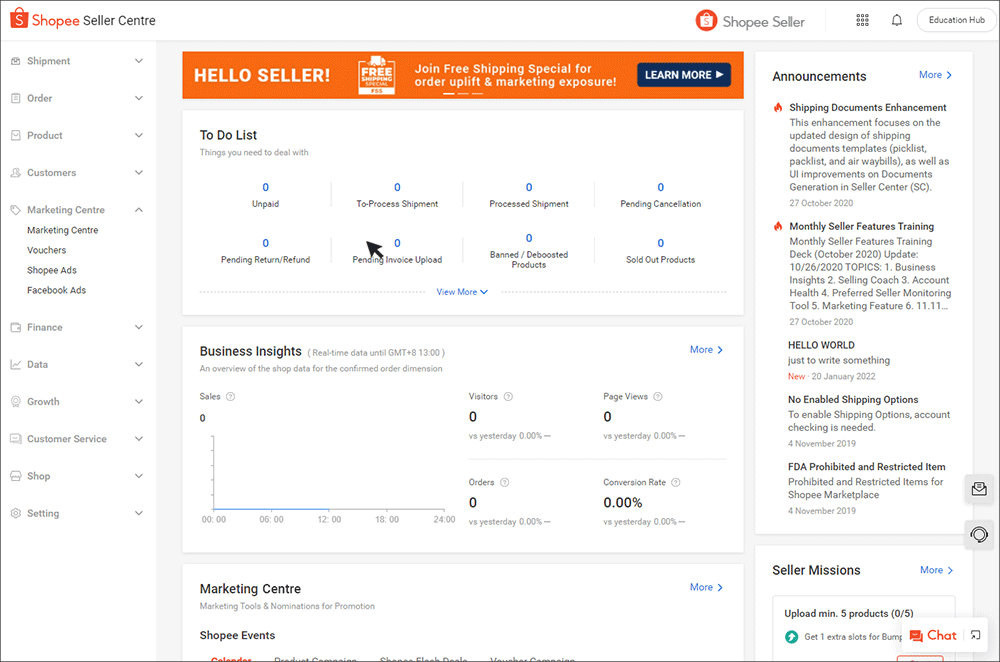
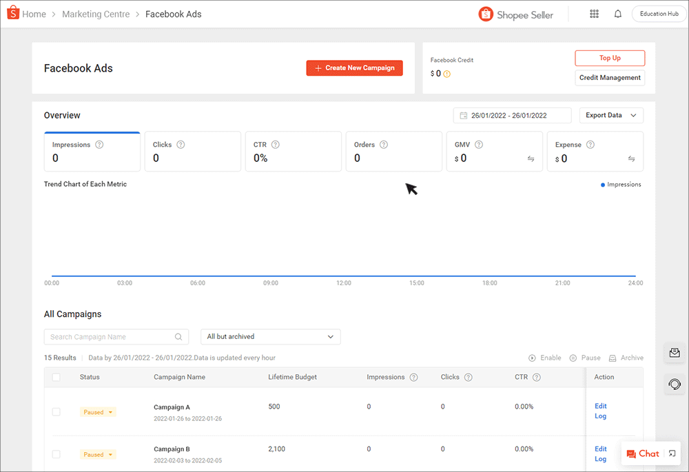

# 设置您的 Facebook Ads 账户

> **来源：** https://ads.shopee.com.my/learn/faq/229/997
> **分类：** Facebook Ads

## 如何开始？

首先，通过 Marketing Centre（营销中心）中的 Facebook Ads 工具创建 Facebook 账户。

点击 **Create** 后，您的账户将在 15 分钟内创建完成。建议您在首个 Facebook Ads 广告活动计划开始前至少 7 天完成账户创建。

Facebook Ads 账户创建完毕后，您即可进行广告金充值。

详细设置指南请参阅此[页面](https://seller.shopee.com.my/edu/article/12056/facebook-ads)。