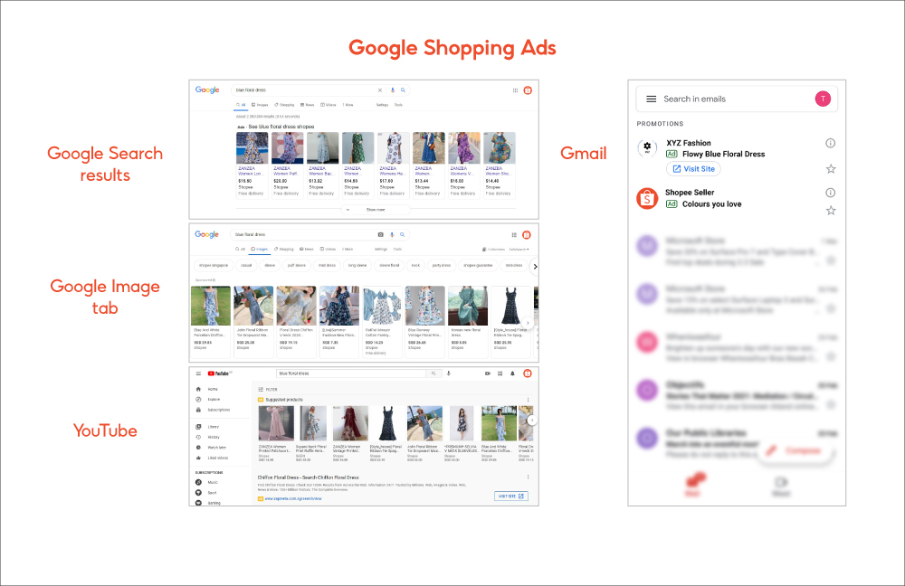
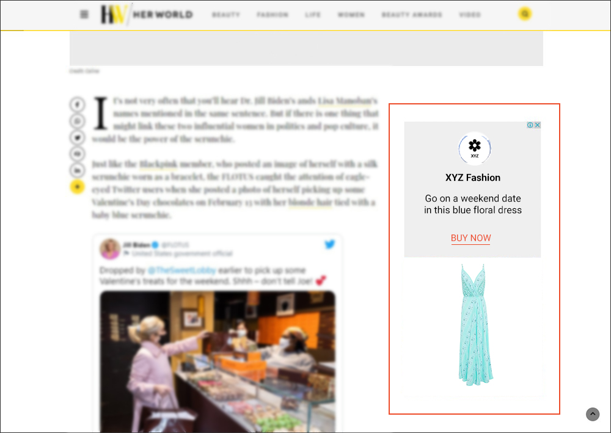

# 使用 Google Ads 推广您的商品

> **来源：** https://ads.shopee.com.my/learn/faq/273/1149
> **分类：** Google Ads

当消费者在 Google 旗下平台输入相关搜索词时，向他们展示您的商品。消费者点击广告后，将直接跳转至您的 Shopee 商品详情页。

## Google Ads 会在哪里展示？

- 在 Google 相关网站上，如 Google Search、YouTube、Gmail 和 Google Discover

- 在 Search Partners 网站上（即与 Google 合作的非 Google 网站）

