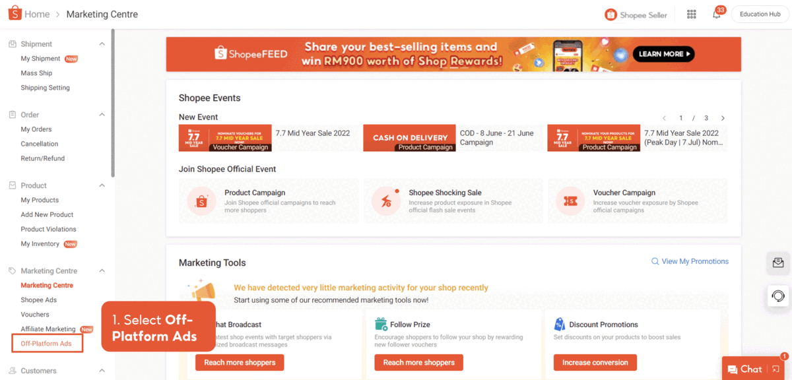
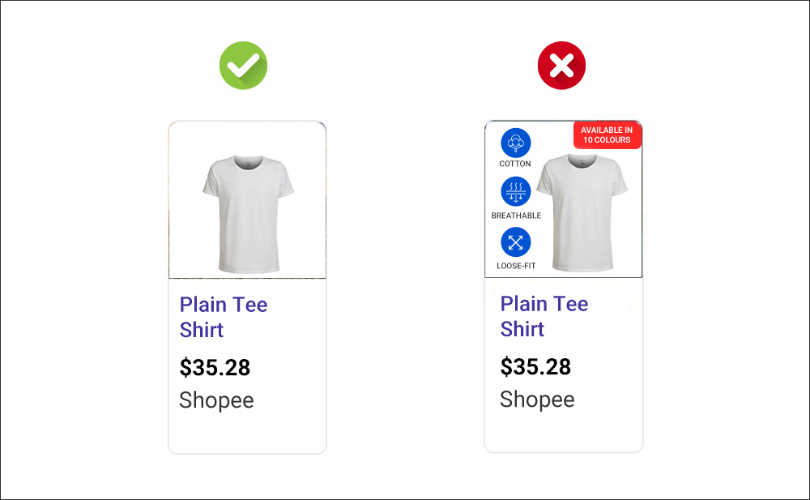
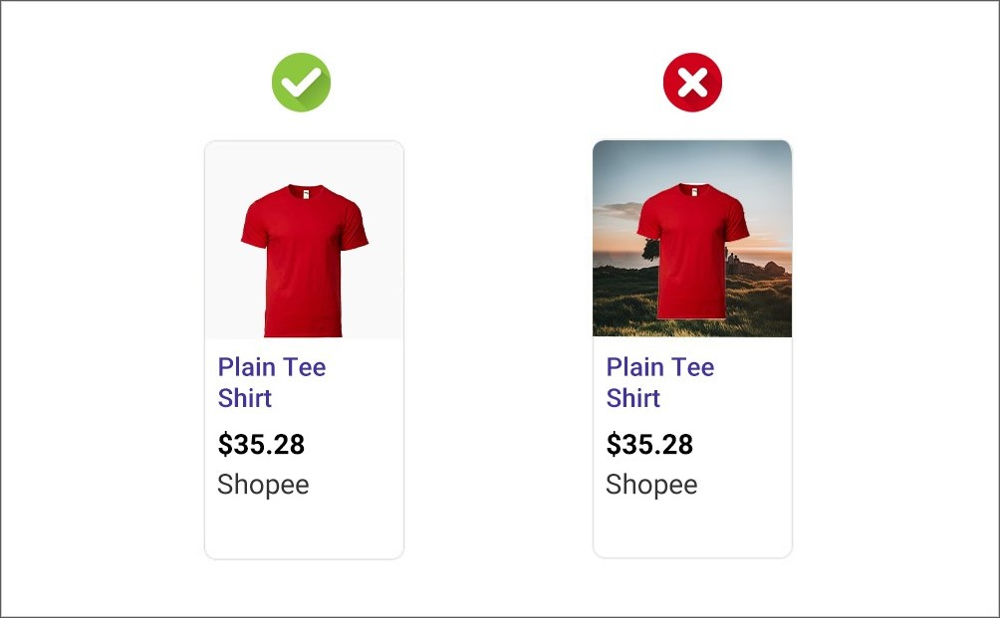

# 创建 Google Ads 广告活动

> **来源：** https://ads.shopee.com.my/learn/faq/273/1130
> **分类：** Google Ads

一个 Google Ads 广告活动包含一个或多个广告，以及预算、商品等相关设置。您可以为店铺中不同的商品分类创建不同的 Google Ads 广告活动。

充值广告金后，即可开始创建广告活动。

## 推荐的广告活动设置

- **每日预算：** 建议每天分配 RM100，以确保广告活动能够积累足够的数据进行学习和优化。
- **广告活动周期：** 建议广告活动至少投放 4 周（前 2 周用于学习，后 2 周用于优化表现）。
- 如果您计划投放 11.11 或 12.12 等季节性大促广告活动，建议至少在实际日期前 2-3 周启动。
- **商品选择：** 为优化广告活动表现，请至少选择 5 件商品。
- **商品图片：** 严格遵循以下指南，确保您的广告获得 Google 在所有平台上的展示批准：
- 避免图片上出现过多文字/Logo

- 使用白色背景的图片

- 注意：商品图片将取自您在 Shopee 上现有商品列表的封面图。优化商品图片有助于提高您的广告在 Google 上比竞争对手更早展示的机会。

## 广告活动信息更新需要多长时间？

- **商品价格或库存更新：** 1 小时内
- 注意：从店铺中删除的商品将在 24 小时内从 Google Ads 中移除。如需在 1 小时内移除，可在删除商品前将库存设为 0。
- **商品标题、图片和描述更新：** 次日生效
- **新增商品列表：** 最多 4 个工作日

了解更多广告活动管理方法，请参阅此[页面](https://seller.shopee.com.my/edu/article/6533)。