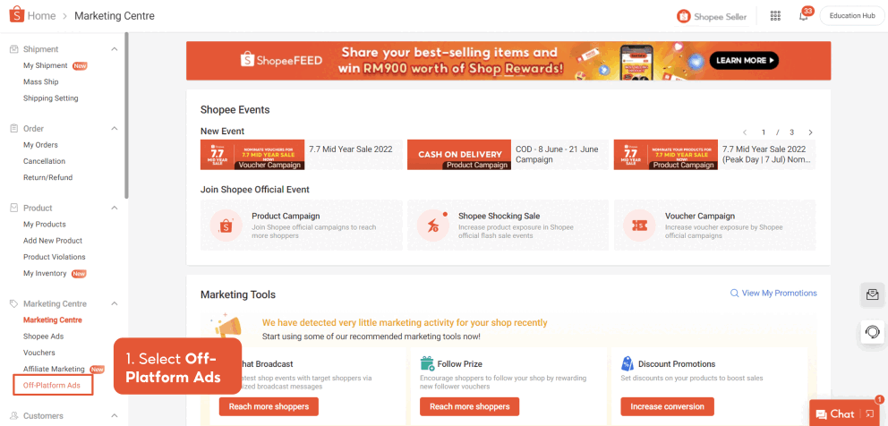
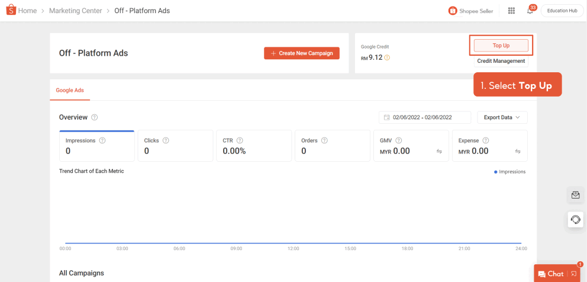

# 设置 Google Ads 账户

> **来源：** https://ads.shopee.com.my/learn/faq/273/1148
> **分类：** Google Ads

## 如何开始？

要开始使用，您需要在 Shopee Seller Centre 创建账户并充值广告金。

Google 账户创建后，可能需要等待最多 1 天，店铺商品才会在账户中显示。

部分入选卖家可在 Seller Centre 同时使用 Facebook Ads 和 Google Ads 工具。如果您属于此类卖家，请了解如何[管理跨不同站外广告的广告金](https://drive.google.com/file/d/1jdBEPqseZf6iFnnShxK2Apz7PLz0sSb7/edit)。

## 开始需要多少预算？

您可以根据每日广告预算和计划投放 Google Ads 的天数来充值广告金：**每日预算 × 广告投放天数 = 充值金额**

广告活动投放约 14 天后，您可以通过以下指标评估初始预算是否合理：

- **Cost per Click / CPC（单次点击成本）：** 广告总花费除以点击次数。
- **Traffic（流量）：** 广告活动启动前后的访客数量。这会影响预算消耗的速度。
- **Campaign Run Rate（广告活动消耗速度）：** 预算消耗的速度。用于评估预算完全消耗所需的时间。

一旦广告金余额降至 0，所有 Google Ads 广告活动将暂停。在重新充值广告金之前，您将无法创建新的广告活动。

详细设置指南请参阅此[页面](https://seller.shopee.com.my/edu/article/6533)。