# Brand Max Ads 介绍

> **来源：** https://ads.shopee.com.my/learn/faq/503/2272
> **分类：** Brand Max Ads

**什么是 Brand Max？**

Shopee Brand Ads 将升级为全新的广告产品——Brand Max。它将利用站内多元化的广告版位，集中提升品牌知名度并引入更多潜在买家。Brand Max 最多可覆盖 Shopee 上 4 个优质广告位，最大化广告可见度，帮助卖家高效触达目标受众。

**Brand Max 的可用版位：**

- Daily Discover Banner（每日发现横幅）
- Floating Widget Banner（悬浮组件横幅）
- Search Page Prefill Keywords（搜索页预填关键词）

*特别说明：部分站点可能无法使用全部四个版位，如有疑问或需求，请联系您当地的 RM。*

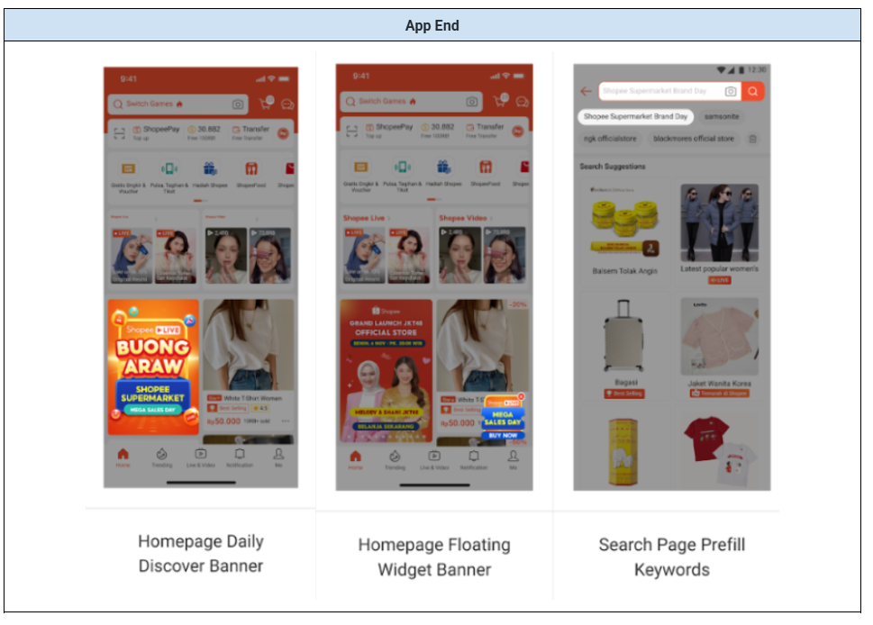
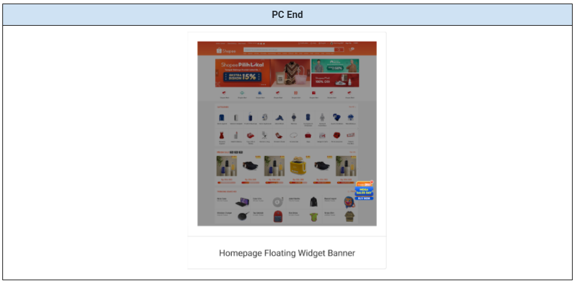

**Brand Max 的核心优势**

**1. 一站式品牌建设**

Brand Max 通过多元化版位展示和基于算法的高效优化，结合简便的广告设置，为卖家提供一站式品牌体验。使用 Brand Max，卖家只需输入广告时长和预算并提交广告，系统将智能优化所有可用版位的广告曝光和受众定向，触达更多品牌目标受众，特别是潜在买家。

**2. 一个 Brand Max 广告满足多种品牌需求**

Brand Max 将在所有可用版位中随机展示。针对每个版位，卖家可上传不同系列的创意素材，突出不同的营销信息。基于不同版位的位置和横幅样式，卖家可决定如何相应布局品牌图片和品牌陈述。通过 Brand Max，卖家不仅获得了更广阔的品牌形象和品牌愿景展示空间，还能将不同的营销需求和场景（如新品上市、大促日等）有机结合，共同促进销售。

**3. 保证预订展示量的完整投放**

Brand Max 将保证预订库存的展示量完整交付。卖家成功创建 Brand Max 广告后，相应的 Brand Max 预算将在广告钱包中冻结，以防止因广告金余额不足而导致 Brand Max 意外暂停或停止。此外，Brand Max 按实时消耗计费，同时确保累计广告费用不超过卖家设定的预算。

*特别说明：系统将尽力完成 100% 展示量交付，同时 Brand Max 侧重于引入新的 Opportunity (O)、Aware (A1) 和 Appeal (A2) 受众，因此偶尔可能出现展示量未完全交付的情况。*

**4. 提升品牌知名度，收获更多潜在客户**

随着全新升级的品牌广告 Brand Max 上线，Shopee 还将引入新的品牌广告效果衡量模型：**O-4A Audience Model（O-4A 受众模型）**（目前仅对 Brand Max 用户开放）。通过 O-4A 受众模型衡量，Brand Max 旨在**1) 增加新的 Opportunity (O)、Aware (A1) 和 Appeal (A2) 受众**，以及**2) 通过 O 和 A1 向 A2 转化带来更高的转化率**，从而提升品牌知名度并吸引更多潜在客户（Appeal 受众）。

O-4A 五种受众类型的定义：
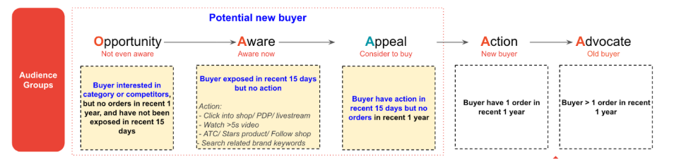
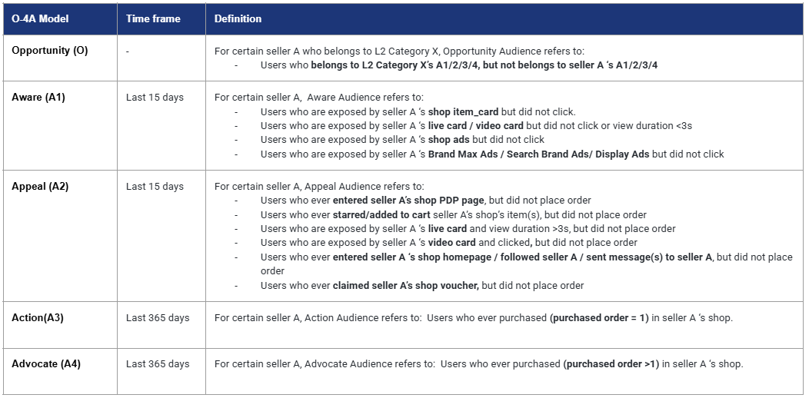

**Brand Max 最佳实践建议**
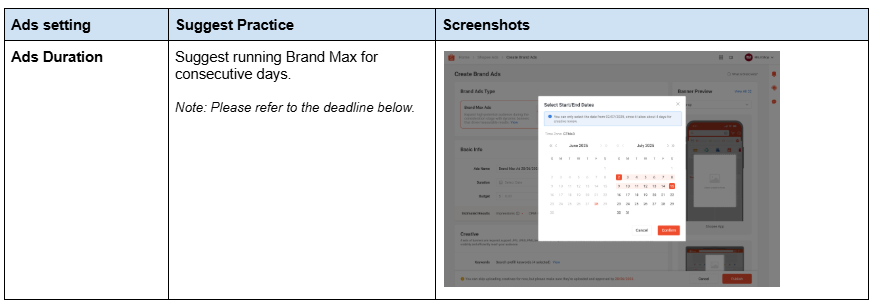
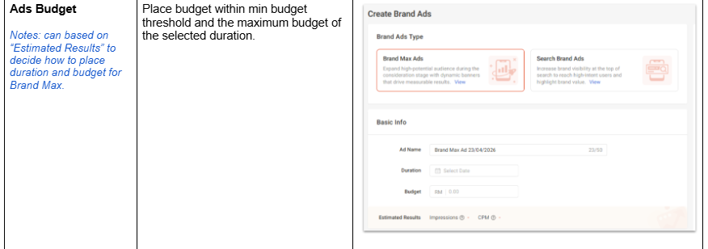
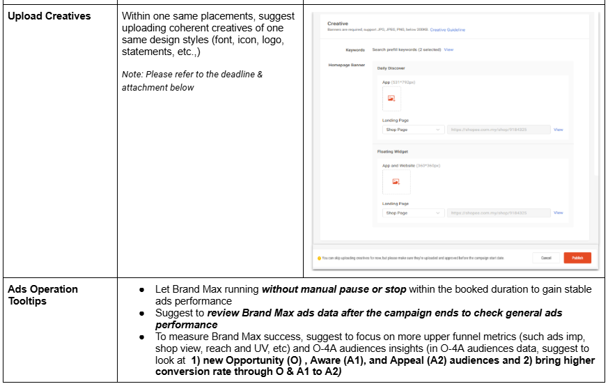

**用户指南：广告创建流程与效果衡量**

**如何通过 PC 端创建 Brand Max 广告**
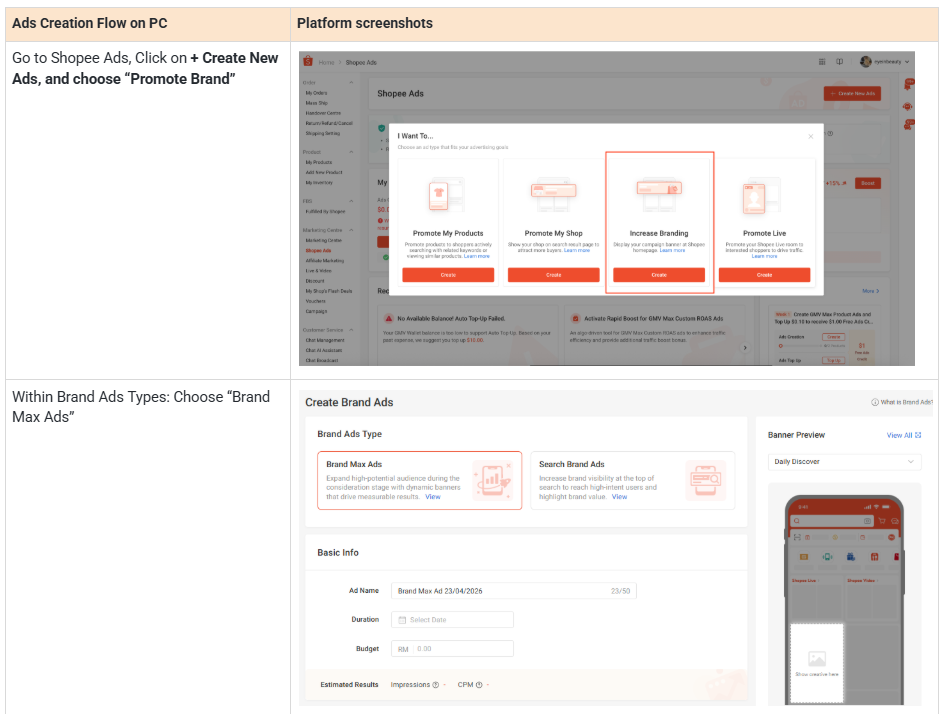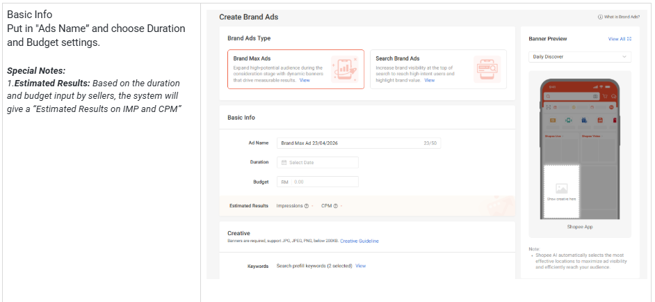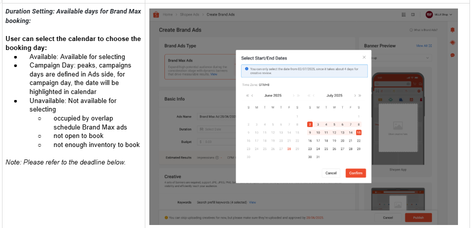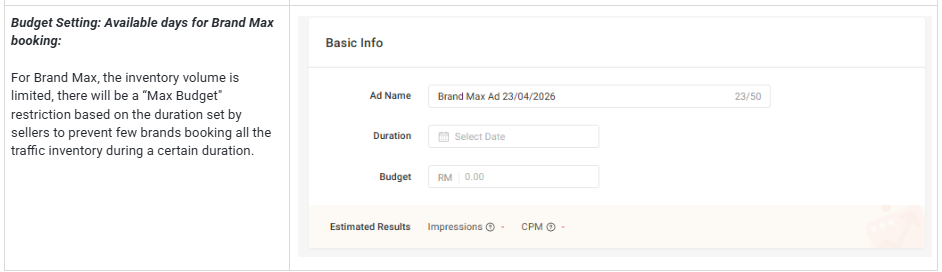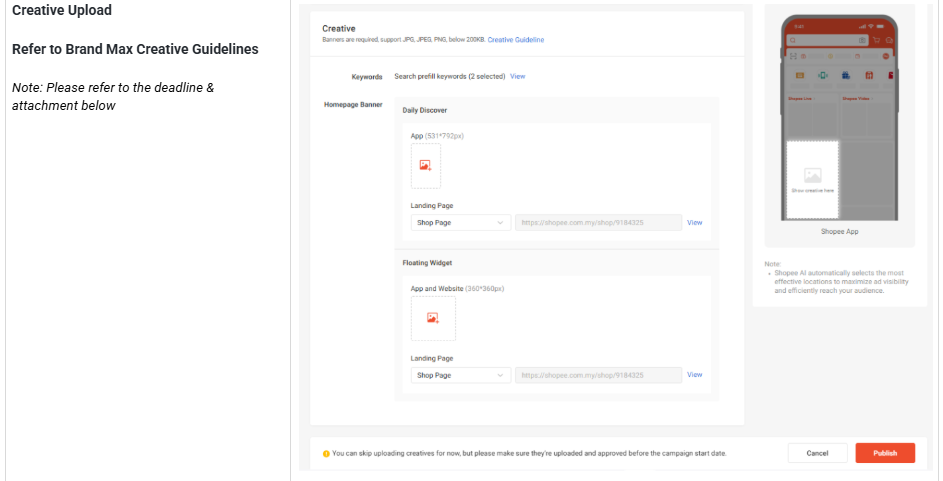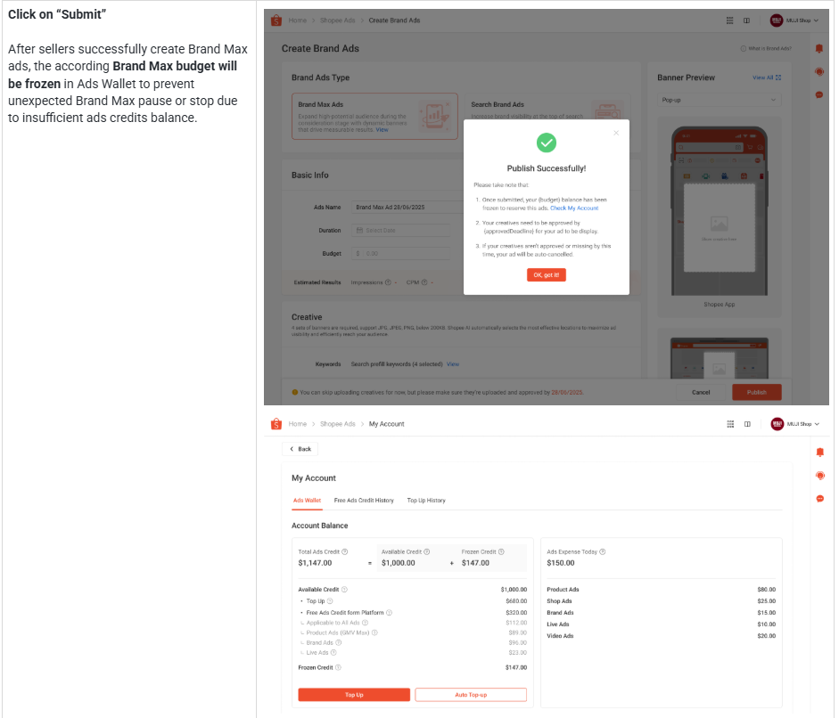

**Brand Max 截止时间节点**

请严格遵守以下时间节点，以确保 Brand Max 广告顺利投放：

- D-13：预订截止日（Booking deadline）
- D-4：创意素材提交截止日（Creative submission deadline）

示例：若 Brand Max 广告排期在 D-day（6 月 6 日）上线：
- D-13 预订截止日：最迟 5 月 23 日完成预订
- D-4 创意素材提交截止日：最迟 6 月 1 日提交广告创意

**如何衡量 Brand Max 效果？**

**i. Seller Center 广告详情 - 数据报告**

Brand Max 广告详情页将展示"Audience Movement Analysis（受众流转分析）"和"Ads Performance（广告表现）"数据：

- **Audience Movement Analysis：** 查看通过 Brand Max 广告获得了多少新受众（从上一级受众类型转化而来）
- **Ads Performance：** Impression、Click、CTR、Shop View、Unique Visitor、CPM、Expense

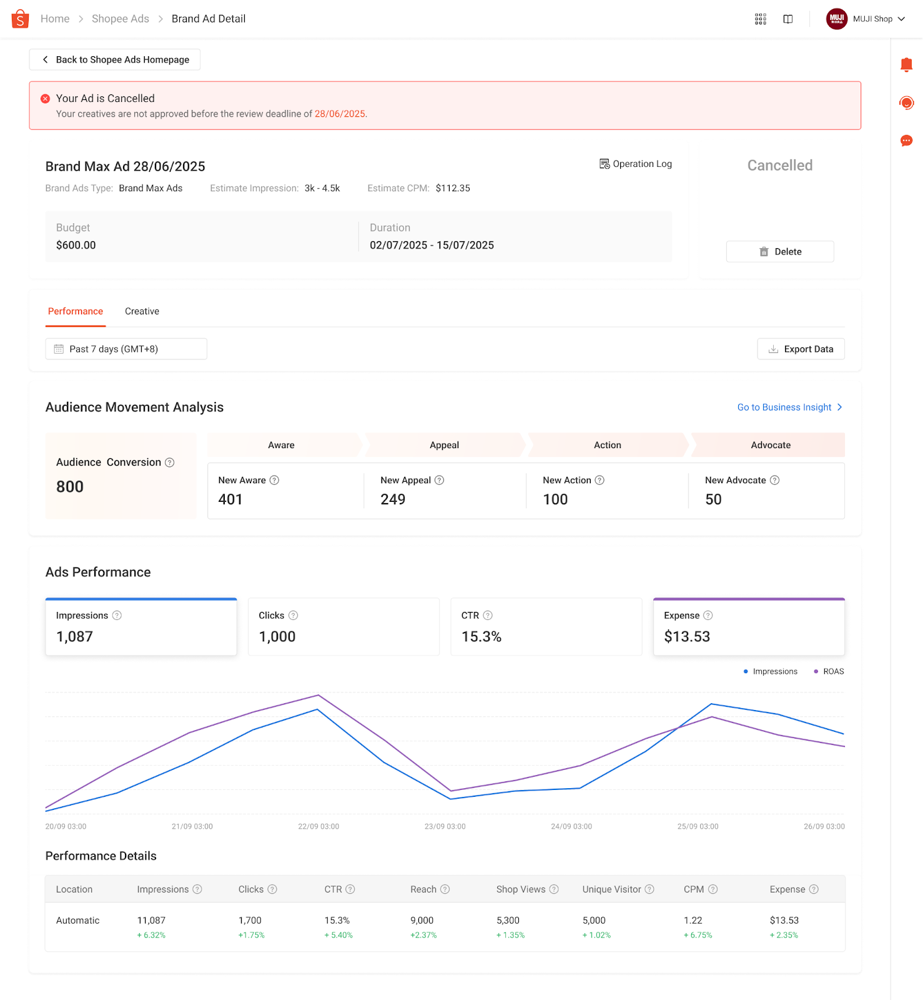

**ii. 在 Seller Center - Business Insights 中追踪 O-4A 受众数据**

Seller Center 的 Business Insights 标签页将为 Brand Max 用户独家提供新的 **Audience** 标签页，展示 O-4A 受众数据详情，包括受众规模和五种不同受众类型之间的流转情况。

- **Audience Size Overview（受众规模概览）：** 截止选定日期的 O-4A 受众规模概览，支持选定日期之间的对比，查看各受众类型的增幅百分比。同时提供"Competitor Benchmark（竞品对标）"供卖家参考。
- **O-4A Audience Circulation（受众流转）：** 在"Audience Conversion Analysis"中，卖家可查看特定时间范围内不同类型受众 (O-4A) 之间的流转情况。时间范围：可选择过去 6 个月内任意日期的数据，并与 1 个月前同一天的数据进行对比（"Start Date"固定为上月的同一天）。按 Source / Destination 维度：可在 O-4A 受众类型中任选类型作为源或目标，查看流转情况（Conversion Amount 与 Conversion Rate）。

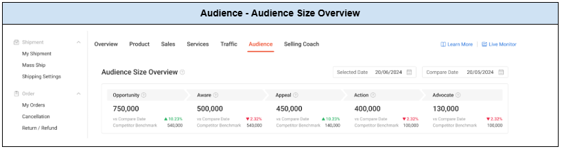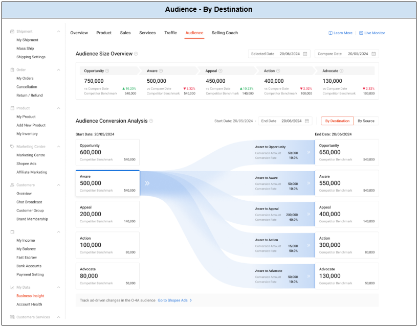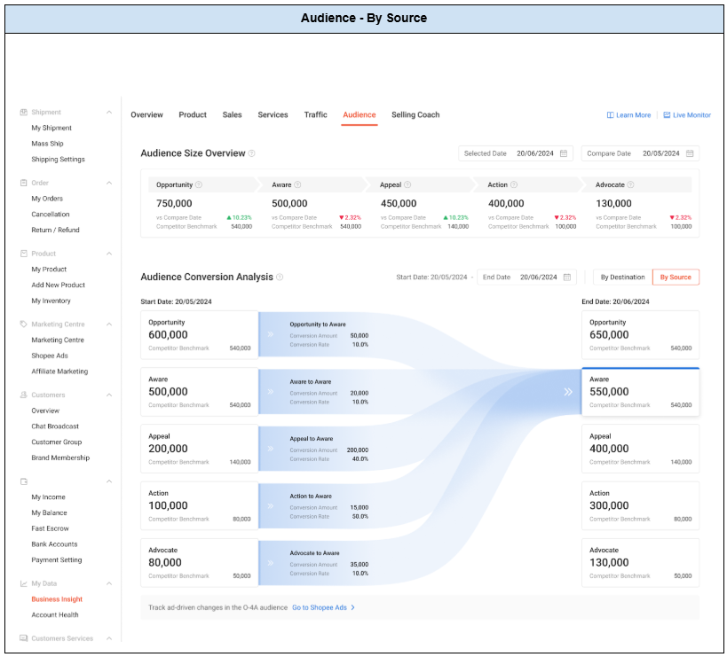