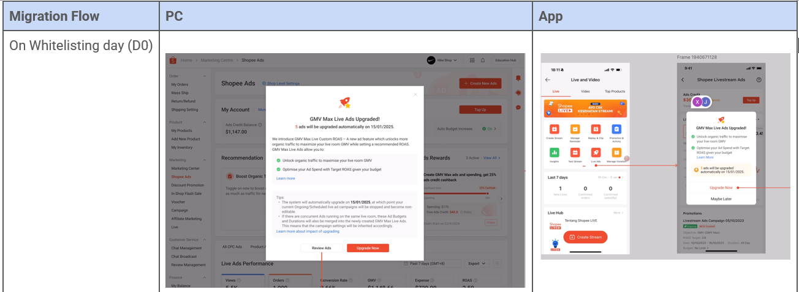

# GMV Max Live 迁移指南

> **来源：** https://ads.shopee.com.my/learn/faq/360/2013
> **分类：** Live Ads（直播广告）

## 原有 Custom ROAS 广告迁移至 GMV Max Live - Custom ROAS

### 1) 什么是迁移？

*注：为简化表述，旧版 Live Ads Custom ROAS 功能简称为 Custom ROAS 1.0，旧版 Live Ads Auto Bidding 功能简称为 Auto Bidding 1.0。*

**背景：** 在 GMV Max Live - Custom ROAS 和 GMV Max Live - Auto Bidding 的迁移过程中，原有的 ROAS 1.0 出价产品（Custom ROAS 1.0 和 Auto Bidding 1.0）将被弃用并不再可用。为充分利用 GMV Max Live 的功能优势并避免 1.0 广告与升级版 GMV Max Live 之间的内部竞争，从 ROAS 1.0 迁移至 GMV Max Live 是必要的。

**谁需要迁移？何时迁移？** 迁移当日，仅持有"已排期"和"进行中"的 ROAS 1.0（Custom ROAS 1.0 和 Auto Bidding 1.0）广告的用户将被迁移。迁移进程与功能上线同步推进（例如某广告主在 D0 同一天被加入 GMV Max Live 功能白名单并开始迁移）。

**迁移流程持续 7 天：**
- **功能创建与迁移白名单日（D0）：** 广告主将看到更新后的 GMV Max Live 创建流程，并触发迁移工具看到弹窗。若广告主点击"Upgrade Now"，所有进行中/已排期的 ROAS 1.0 广告将立即迁移至 GMV Max Live。
- **迁移日（迁移提示后第 7 天）：** 若广告主在 D0 未点击"Upgrade Now"，其已排期和进行中的 ROAS 1.0 广告将直接迁移至 GMV Max Live。所有仍在运行或已排期的 ROAS 1.0 广告将自动停止（即使广告主不升级）。广告主仍可在 Shopee Ads 中访问查看广告表现，但无法编辑或重启这些广告。

*特别说明：若某广告主同时被列入 GMV Max Live - Custom ROAS 和 GMV Max Live - Auto Bidding 白名单，但仍持有进行中/已排期的 Custom ROAS 1.0 和 Auto Bidding 1.0 广告，所有 ROI 1.0 广告将全部迁移至 GMV Max Live - Custom ROAS。*

### 2) 迁移期间广告设置继承
