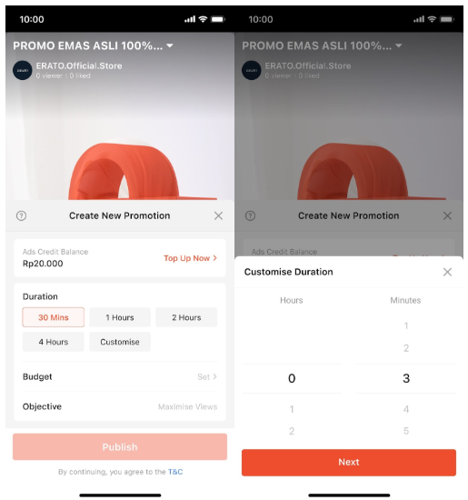
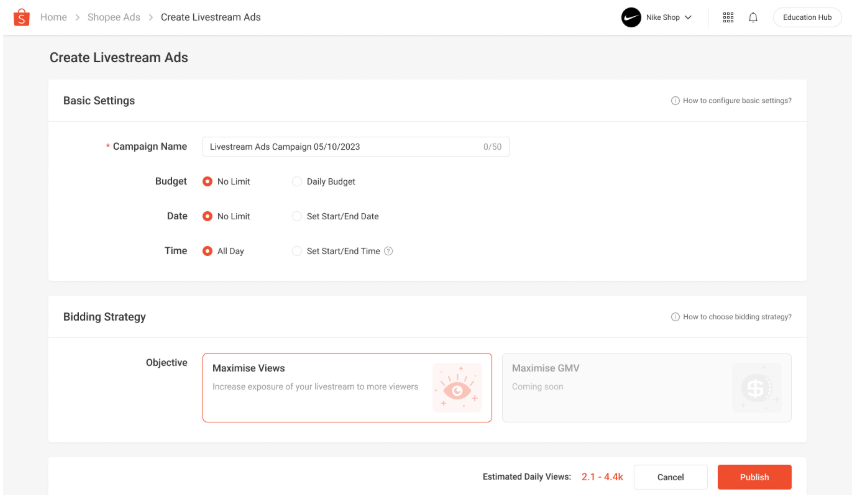
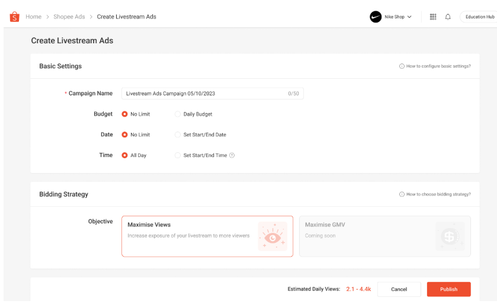

# 如何创建 Shopee Live Ads

> **来源：** https://ads.shopee.com.my/learn/faq/360/1557
> **分类：** Live Ads（直播广告）

设置和投放直播广告活动只需几个简单步骤即可完成基本设置和出价策略配置。

**在 App 上创建 Live Ads**

**基本设置**

设置投放时长，App 端允许设置的时长范围为 30 分钟至 24 小时。

**设置预算**

- 对于"进行中"的广告，广告预算只能设置为高于当日已消耗的广告费用。
- 对于其他状态的广告，若用户将预算调低至低于当日已消耗费用，广告将立即隐藏至次日。

**出价策略**

- 出价方式：当前阶段仅支持自动出价（Auto Bidding）。
- 目标：Maximise Views（最大化观看量，默认选择），未来将开放更多目标选项。

**在 PC 端创建 Live Ads**

**基本设置**

**设置广告活动名称**

系统预填广告活动名称，用户可自定义修改。

**设置预算**

可设置固定预算或"No Limit（无限制）"。

**设置日期**

固定日期范围或"No Limit（无限制）"。

**设置时间**

"All Day（全天）"或一天中的特定时段，广告将在每天的该时段内重复投放。

**出价策略**

- 出价方式：当前阶段仅支持自动出价。
- 目标：Maximise Views（默认选择），即将推出 Maximise GMV。

要在 Shopee 上投放广告，您需要确定合适的预算、时长和版位。预算和时长决定了广告的活跃时长。您应选择一个自己能够接受、愿意每日支出的金额。