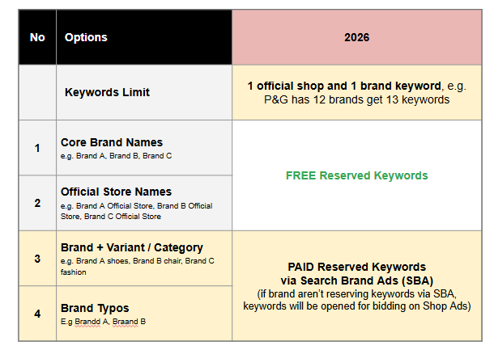
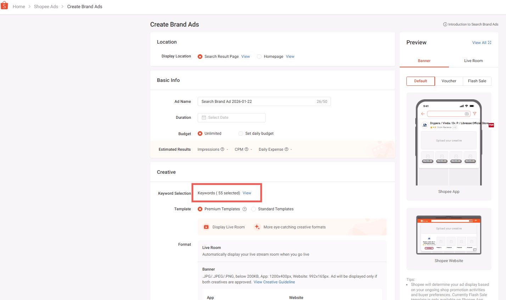
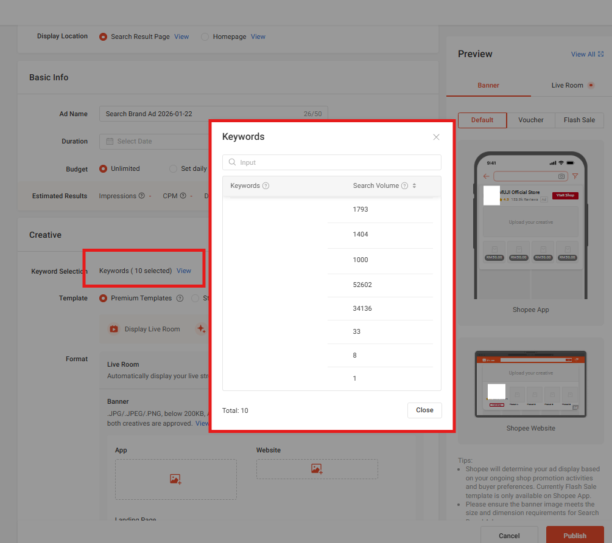

# Search Brand Ads 免费与付费关键词预订（仅限 Mall Seller）

> **来源：** https://ads.shopee.com.my/learn/faq/504/2218
> **分类：** Search Brand Ads（搜索品牌广告）

为提升 Shopee 平台整体用户体验，我们于 2026 年 1 月更新了关键词预订政策。

1. **付费和免费关键词**预订**仅面向 Mall Seller 开放**。

2. 关键词预订不保证一定成功，需经审核并符合资格要求，且受其他卖家已有预订情况的影响。

**免费预订关键词**

1. 仅允许将官方店铺名称、品牌名称及用户名作为免费预订关键词。

2. 拥有多个品牌的卖家可为每个品牌名称分别预订。

**付费预订关键词**

1. 付费预订关键词适用于 Search Brand Ads。

2. 卖家可为 Search Brand Ads 预订以下类型的关键词：

- 品牌 + 变体/类目（如：Brand A shoes）
- 品牌拼写错误变体
- 店铺名称变体（如：BrandAshop、Brand A shop——含或不含空格）
- 品牌名称变体（如：BrandA、Brand A——含或不含空格）
- Shop + 其他品牌名称（如：Shop + Brand A）*（仅当该店铺为该品牌的授权经销商时允许）*

- 请注意：若 SBA 停止投放（因预算耗尽、广告活动暂停或其他原因），付费预订关键词将自动释放，供其他卖家在 Shop Ads 中公开竞价。SBA 重新激活后，关键词将恢复预订。

**如何提交关键词**

- 卖家可通过提供的 Google Form 提交免费和付费关键词：[[Shopee Mall] Keyword Reservation](https://forms.gle/XkBWrZmVtABhhvwF9)
- 预订关键词须在**每周五上午 10:00 前**提交以供内部审核。
- 关键词预订将于**每周五下午 5:00 更新**，周末和节假日除外。*获批关键词最多需要 24 小时才能在系统中生效。*
- 预订的付费关键词可在 Seller Center 创建 Search Brand Ads 时查看。

