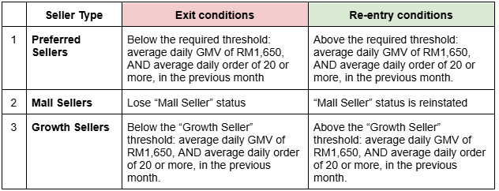
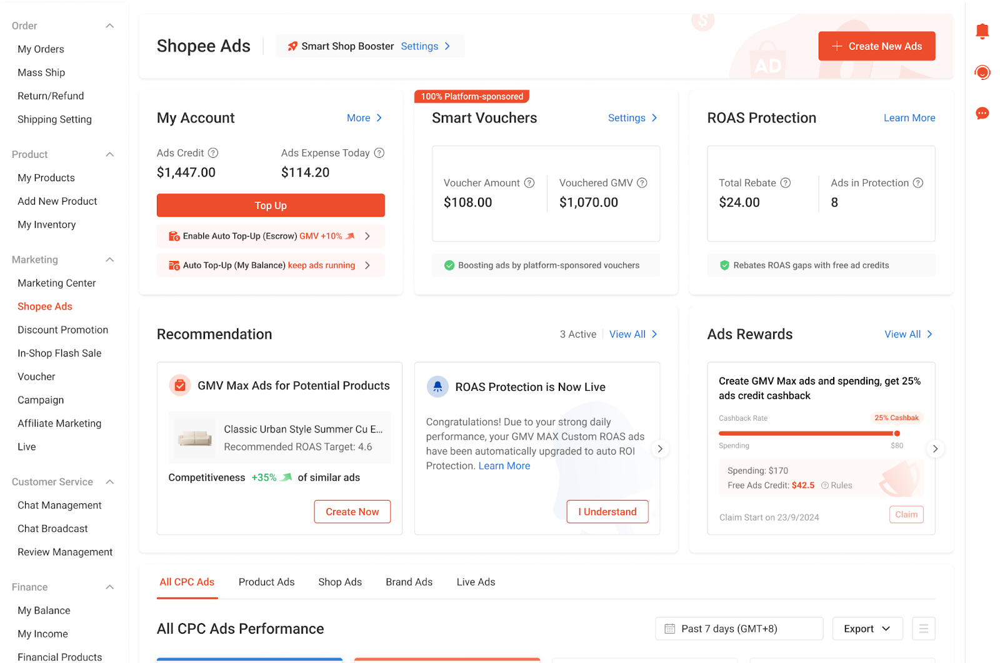
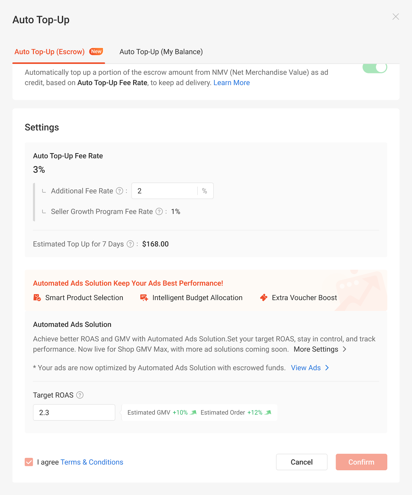
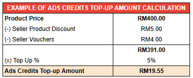
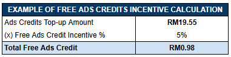
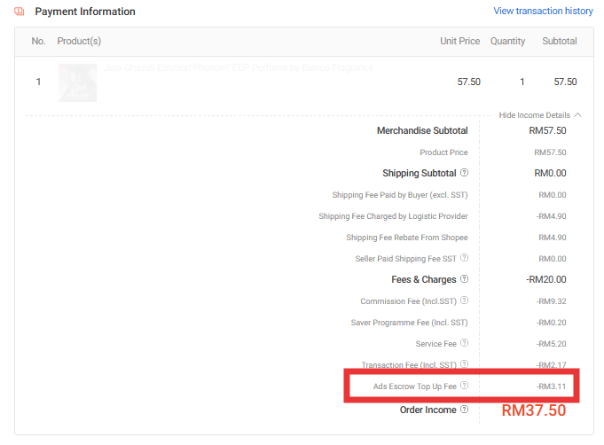
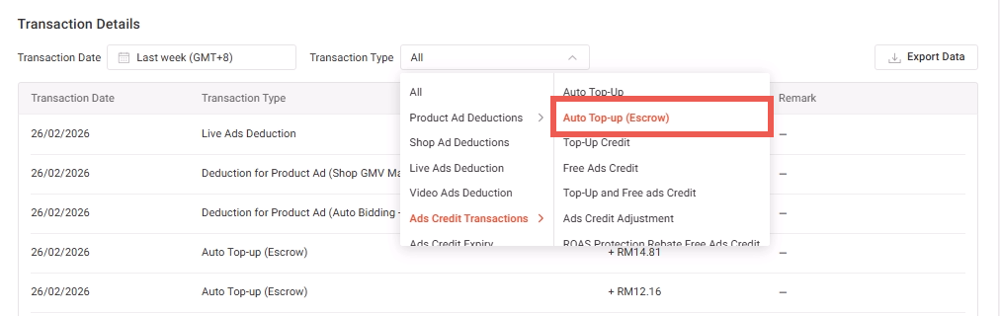
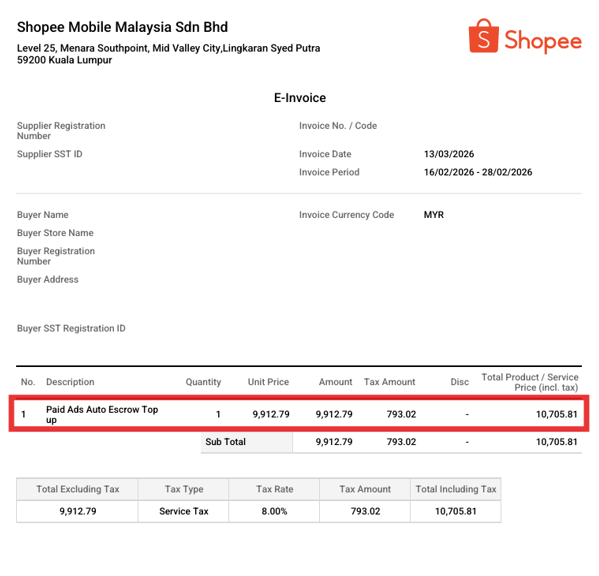
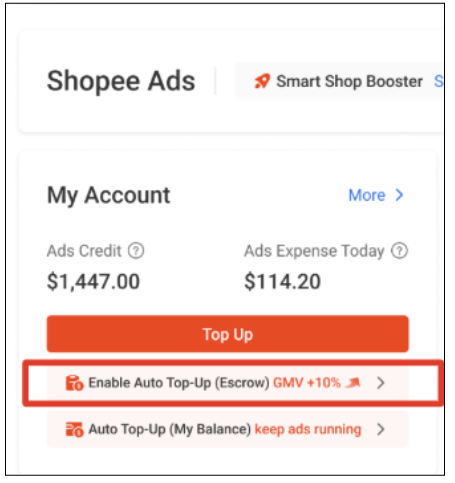
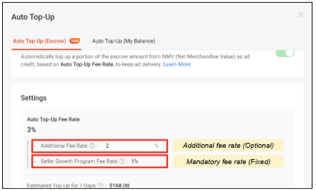

# Shopee Ads Growth Plan（广告成长计划）

> **来源：** https://ads.shopee.com.my/learn/faq/78/2133
> **分类：** 用户指南

**什么是 Shopee Ads Growth Plan？**

Shopee Ads Growth Plan 旨在加速卖家的成长。每笔已完成订单的一定比例（基于商品价格，扣除所有卖家商品折扣和卖家优惠券后）将自动转化为广告金，充值到卖家的账户中。

这些广告金直接计入卖家的广告金余额，使卖家无需任何额外操作即可推广商品、获取更多流量、提升销售。

**Shopee Ads Growth Plan 何时开始？**

Shopee Ads Growth Plan 自 2025 年 10 月 25 日起生效。自 2026 年 2 月 2 日起，以下若干修订将正式生效：

- 转化与充值将迁移至 Auto Top-up (Escrow) 自动充值（托管）功能，该功能会在订单完成时即时将您销售收入的一小部分自动转化为广告金，无需等待每周的注入周期。
- 卖家的准入门槛及转化率已作更新，详见下文说明。

**谁有资格参与 Shopee Ads Growth Plan？**

Shopee Ads Growth Plan 适用于以下本地卖家（不包括跨境卖家）：

1) **Preferred Sellers（优选卖家）**。自 2026 年 2 月 2 日起，Preferred Sellers 还需满足以下订单和 GMV 门槛方可入选：

上月日均 GMV 不低于 RM1,650，且日均订单不少于 20 单。

2) **Mall Sellers（商城卖家）**

3) 在 2 月 2 日之前符合"Large Sellers"标准、或自 2 月 2 日起符合"Growth Sellers"标准的入选卖家，详见下方条款与条件（状态于每月 1 号更新）。

a) 入选卖家可在 Seller Center 中 Shopee Ads 模块的 Auto Top-Up (Escrow) 板块查看自己的资格状态。

**退出与重新入选条件**

若出现以下退出条件，参与 Shopee Ads Growth Plan 的卖家将被自动退出。若后续满足重新入选条件，则可再次适用：

**Shopee Ads Growth Plan 的充值金额是多少？**

Ads Growth Plan 的转化率已作更新，以更好地帮助卖家成长：

1) 对于 2025 年 12 月 1 日及之后加入 Ads Growth Plan 的卖家，转化率维持在 2%。

2) 对于 2025 年 12 月 1 日之前加入 Ads Growth Plan 的卖家，修订后的转化率如下：

a) 电子类卖家：3%

b) 所有其他品类：5%

新入选的合格卖家还将在加入之日起 12 周内额外获得 5% 的免费广告金。在 2 月 2 日前已加入 Ads Growth Plan 的卖家，也将继续从其原始加入日期起享受 12 周的免费广告金。

**Auto Top-Up (Escrow) 自动充值（托管）**

Auto Top-Up (Escrow) 可将您订单收入的一部分自动转化为广告金，帮助卖家维持连续的广告投放效果，无需手动充值，确保平稳、不间断的推广和长期增长。

当买家订单完成并进入 Escrow Verified（托管验证）阶段时，系统将自动即时地从您的销售收入中扣除固定比例，并将其转化为广告金。这取代了以往按周累积和分发的旧机制。

Auto Top-Up (Escrow) 功能位于 Seller Center 中 Shopee Ads 模块的新板块，向卖家展示关键信息，包括其 Ads Growth Plan 资格状态、转化率以及自动广告解决方案详情。

了解更多关于 Auto Top-Up (Escrow) 的信息，请参阅我们的[文章](https://ads.shopee.com.my/learn/faq/82/2178)。

**Auto Ads（自动广告）**

配合新的 Auto Escrow Top-up 功能，系统将为您创建一个 Shop GMV Max 广告组，无需手动设置*。此方案通过一个广告活动、一个预算、一个 ROAS 目标来管理您所有尚未投放广告的 SKU，简化广告管理。广告活动上线后，您可随时在 [Shopee Ads 页面](https://seller.shopee.com.my/portal/marketing/pas/index?source_page_id=1)修改目标 ROAS 或暂停广告活动**。

仅当与 Auto Escrow Top-up 功能配合启用时，Shop GMV Max 广告组方可享受 ROAS Protection 保障***。卖家需满足以下条件：广告组日均广告订单不少于 10 单、目标 ROAS 达成率低于 90%、且未以任何方式暂停或更改广告设置。

了解更多关于这些功能，请参阅我们的文章：[Automated Ads Solution](https://ads.shopee.com.my/learn/faq/82/2178)。

注意：

*仅适用于尚无正在运行的广告组的卖家。卖家可随时编辑广告活动，包括暂停广告活动。

**若卖家希望编辑预算，需先暂停广告，再通过"Create Ads"方式新建"Shop GMV Max"广告组。了解更多请参阅我们的文章。

***"Shop GMV Max"广告组的 ROAS Protection 仅限于与 Auto Escrow Top-Up 配套设置的此类广告活动。更改设置将导致您自修改当日起失去 ROAS Protection 保障资格。

**Shopee Ads Growth Plan 如何运作？**

当买家订单完成并进入 Escrow Verified 阶段时，系统将自动从您的销售收入中扣除固定比例并转化为广告金。

系统按以下方式计算每笔已完成订单的广告金金额：

- 充值金额 = (商品价格 - 卖家商品折扣 - 卖家优惠券) × 充值比例%

注意：广告金将在订单完成并达到 Escrow Verified 状态后即时到账。

了解更多关于 Auto Top-Up (Escrow) 功能，请参阅我们的[文章](https://ads.shopee.com.my/learn/faq/82/2178)。

**免费广告金如何计算？**

新入选的合格卖家可自加入之日起 12 周内享受充值金额 5% 的免费广告金。免费广告金自到账之日起 30 天内有效。

免费广告金奖励计算公式：

- 免费广告金 = 已充值广告金 × 5%

**广告金的发放：**

已充值的广告金在订单完成并达到 Escrow Verified 状态后即时直接发放至卖家的广告金余额。免费广告金按周发放（每周第一个工作日下午 12 点前到账）。但大促期间可能因服务器拥堵出现轻微延迟。

**在哪里查看已充值的广告金金额？**

**订单层面：** 合格卖家可在 Seller Center 的订单详情页中查看每笔成功订单的充值广告金金额，显示为"Shopee Ads Growth Plan"行项目。此金额指将作为广告金充值至卖家广告金余额的收入部分。

**交易记录层面：** Ads Growth Plan 广告金可在 Shopee Ads 交易记录的详细分类中追踪，每小时更新一次。

**发票层面：** Auto Escrow Top-up 将与 ATU/手动充值一起显示为电子发票中"卖家增值服务 - 付费广告"（Seller Value-Added Services - Paid Ads）下的行项目。

**常见问题**

**1) 我可以退出 Shopee Ads Growth Plan 吗？**

不可以，该计划适用于所有满足资格条件的卖家。但满足退出条件的卖家将被自动移出计划。例如，若 Preferred Seller 不再达到规定门槛，将被自动移出计划。

**2) 我将从 Shopee Ads Growth Plan 中获得什么奖励？**

新入选的卖家将自首次加入计划之日起 12 周内获得充值金额 5% 的免费广告金。

**3) Shopee Ads Growth Plan 对我有什么好处？**

Shopee Ads Growth Plan 通过将您已确认订单收入的一定比例转化为广告金，帮助您发展业务，让您能够推广商品、触达更多客户。此外，如果您是新入选的卖家，将在加入后的前 12 周获得免费广告金（充值金额的 5%），为您在提升曝光、获取流量、增加销售方面抢占先机。

**4) 在哪里可以查看我有多少收入被转化为广告金？**

您可以通过 3 种方式查看已转化的广告金：

**a) 订单层面：** 合格卖家可在 Seller Center 订单详情页中查看每笔成功订单的充值广告金金额，显示为"Shopee Ads Growth Plan"行项目。

**b) 交易记录层面：** Ads Growth Plan 广告金可在 Shopee Ads 交易记录中按详细分类追踪，每小时更新一次。

**c) 发票层面：** Auto Escrow Top-up 将与 ATU/手动充值一起显示为电子发票中"卖家增值服务 - 付费广告"下的行项目。

**5) 充值比例太高了，我可以设置不同的充值比例吗？**

不可以，充值比例不可调整，该比例经过精心设定，旨在提供充足的广告金以有效推动销售和业务增长。

**6) 如何知道我是否已纳入 Shopee Ads Growth Plan？**

卖家可通过 Seller Center 中 Shopee Ads 模块的 Auto Top-up (Escrow) 功能查看自己的资格状态。

操作方式：前往 Seller Center 中的 Shopee Ads 模块，点击红色方框标示的"Enable Auto Top-Up (Escrow)"：

您将看到如下界面。第二个红色方框突出显示了已纳入 Ads Growth Plan 的卖家，展示 Ads Growth Plan 的指定比例，并在上方提供额外选项框，供卖家在指定比例之上额外设定自愿充值比例。

更多关于 Auto Top-up (Escrow) 功能的信息，请参阅我们的[文章](https://ads.shopee.com.my/learn/faq/82/2178)。

**7) 我已纳入 Shopee Ads Growth Plan，但此前从未使用过广告。我需要了解什么？从哪里开始？**

以下是您入门须知：如果您没有正在运行的广告，Shopee 将自动为您创建广告！请前往 Seller Center 中的 Shopee Ads 页面查看并按需调整。

需要重点检查的事项：

**1) 检查您的出价方式**

选择最适合您业务策略的出价方式：

- GMV Max Auto Bidding：适合希望以最少设置获得便利的卖家。系统自动调整出价以优化表现。
- GMV Max Custom ROAS：让您完全掌控 ROAS。根据自己的目标设定目标 ROAS——较高的 ROAS 目标侧重于最大化广告效率，较低的 ROAS 目标则旨在提升流量和销售潜力。

**2) 检查您的预算**

设置适合您支出偏好的预算：

- 每日预算（Daily Budget）：适合希望控制广告支出的卖家。
- 无限制预算（Unlimited Budget）：适合需要持续投放和更激进推广、不设支出上限的卖家。

**3) 检查您的投放时长**

决定您希望广告投放多长时间：

- 设置开始/结束日期：最适合短期广告活动或季节性促销。
- 无结束日期：适合持续进行的长期广告活动，以保持稳定的曝光和流量。

有关有效设置广告的更多信息，请参阅我们的 [GMV Max 技巧与最佳实践](https://ads.shopee.com.my/learn/faq/505/2136)。

**8) 我之前一直在投放广告，最近被纳入 Shopee Ads Growth Plan，我需要注意哪些变化？**

如果您之前就在投放广告，且 Shopee Ads Growth Plan 现在适用于您，以下是您需要知道的：您将自动在广告金余额中收到充值广告金和免费广告金，这些广告金可用于您现有的"进行中"广告。不要浪费这些广告金——务必用它们来提升流量和销售。

为获得最佳效果，请定期检查广告表现并相应优化。查看 Shopee Ads 商品列表页面的"诊断"（Diagnosis）板块，系统会在那里提供关于 ROAS 目标和预算的个性化建议，帮助您改善广告活动。更多指导，请务必浏览我们的 GMV Max 技巧与最佳实践。

**9) 充值金额何时计入卖家账户？**

已充值的广告金在订单完成并达到 Escrow Verified 状态后即时直接发放至卖家的广告金余额。免费广告金按周发放（每周第一个工作日下午 12 点前到账）。但大促期间可能因服务器拥堵出现轻微延迟。

**Ads Growth Plan — 条款与条件**

- Shopee Ads Growth Plan 面向"Official Sellers"、"Preferred Sellers"、"Large Sellers"和"Growth Sellers"（统称"合格卖家"或"您"），旨在通过自动将每笔已完成订单的商品价格扣除卖家商品折扣和卖家优惠券后的固定比例（具体比例由 Shopee 不时确定，下称"订单金额"）转化为 Shopee"广告金"（下称"转化"），促进店铺增长。转化生成的广告金可用于在 Shopee 上投放广告。转化适用于所有已完成并达到 Escrow Verified 状态之订单，相关扣除将通过 Auto Top-Up (Escrow) 功能即时执行。
- 所有持有 Official Seller 标签或 Preferred Seller 标签（且自 2026 年 2 月 2 日起，上月日均 GMV 需达到 RM1,650 或以上且日均订单达到 20 单或以上）的本地（非跨境）卖家，以及符合 Large Sellers 或 Growth Sellers 标准的卖家，均将被纳入此 Shopee Ads Growth Plan。
- 若当前参与 Ads Growth Plan 的卖家不再满足此标准，将被自动移出。但他们可在未来选择重新加入并享受相关权益。
- "Official Seller"或"Preferred Seller"的卖家身份每日更新，并在广告金到账前的下一周反映在系统中。
- 2026 年 2 月 2 日前"Large Seller"或自 2026 年 2 月 2 日起"Growth Seller"的卖家身份，将根据上述第 2 条的标准于每月第 1 天更新。就本条款与条件而言，"Large Sellers"指上月日均 GMV ≥ RM13,000 或日均订单 ≥ 65 的卖家；"Growth Sellers"指上月日均 GMV ≥ RM1,650 且日均订单 ≥ 20 的卖家。
- 作为 Shopee Ads Growth Plan 的一部分，合格卖家同意：
- Shopee 按订单金额（扣除运费、折扣和优惠券等后，含 SST）的一定比例从所有成功订单中扣除相应金额用于转化；
- Shopee 为 Ads Growth Plan 中尚无正在运行的广告组（Shop GMV Max）的所有卖家创建一个 Shop GMV Max 广告组，并允许算法优化该广告，但不优化卖家店铺中可能正在进行的其他广告——这些广告若保持活跃状态，将继续消耗卖家广告金余额中的广告金。卖家可随时编辑此广告活动，包括暂停广告活动、调整广告活动的 ROAS 目标以及调整广告组中的商品；
- Shopee 将持续执行上述扣除，直至合格卖家不再符合 Shopee Ads Growth Plan 的资格条件。
- 转化将以 Shopee 付费广告金的形式进行，无需额外费用。付费广告金无有效期，可用于 Shopee 平台提供的任何及所有广告类型，包括但不限于 Product Ads、Shop Ads 和 Live Ads。注意，不包括 Homepage Brand Ads。
- 转化金额将通过 Auto Top-Up (Escrow) 功能即时记入卖家账户。当买家订单完成并进入 Escrow Verified 阶段时，系统将自动从卖家销售收入中扣除一定比例并转化为广告金。
- 在退货或退款的情况下，合格卖家仍需将转化金额支付至合格卖家的 Shopee Ads 钱包。
- Shopee 还将为新入选 Ads Growth Plan 的合格卖家提供转化金额 5% 的 Shopee 免费广告金。免费广告金将在首周过后的前 12 周内，于每周第一个工作日发放。免费广告金可用于 Shopee 平台提供的任何及所有广告类型，包括但不限于 Product Ads、Shop Ads 和 Live Ads（Homepage Brand Ads 除外）。免费广告金有效期为 30 天，逾期失效。
- 若 Shopee 自行决定创建一个 Shop GMV Max 广告组：
- Shopee 将自动确定预算设置和 ROAS 目标，以按其认为合适的方式使用您的广告金为您创建广告；
- 合格卖家无法编辑系统设置的每日预算。若合格卖家希望调整每日预算，可暂停系统自动创建的广告组并手动新建一个 Shop GMV Max 广告组。
- Shopee 将使用上述决定的设置，无限期创建广告。
- 所有系统创建的 Shop GMV Max 广告组均符合 ROAS Protection 资格——这是一种免费广告金返利，旨在鼓励合格卖家通过广告活动实现更稳定的表现。若满足以下条件，卖家将自动获得广告金返利（将显示在 Ads Homepage 上）：
- 广告日均订单 ≥ 10 单；且
- 目标 ROAS 达成率低于 90%，即实际 ROAS 低于原始目标 ROAS 值的 90%；且
- 广告活动未被暂停，也未更改设置（在此情况下，操作当日不计算返利）。
- 对于尚无正在运行的广告组（Shop GMV Max）的卖家，该 Shop GMV Max 广告组将于 2026 年 2 月 2 日中午 12 点前创建。
- 更多关于 Auto Top-Up (Escrow) 和自动广告解决方案的信息，请参阅此[文章](https://ads.shopee.com.my/learn/faq/82/2178)。
- 更多关于广告组（Shop GMV Max）的信息，请参阅此[文章](https://ads.shopee.com.my/learn/faq/505/2078)。
- 合格卖家确认，参与者可随时自行创建任意数量的广告，亦可随时移除其认为必要的广告。
- Shopee 有权自行决定随时修改条款与条件、限制或终止此 Shopee Ads Growth Plan，恕不另行通知。对本条款与条件的任何及所有解释权均由 Shopee 决定。
- Shopee 对因 Shopee Ads Growth Plan 引起或与之相关的任何索赔、费用、伤害、损失或损害（包括但不限于与人身伤害、死亡、财产损坏、损失或毁坏、肖像权或隐私权、诽谤或虚假曝光相关的索赔、费用、伤害、损失或损害）概不负责。
- Shopee 服务条款和 Shopee 其他政策中的所有其他条款（如适用）将继续适用于合格卖家。