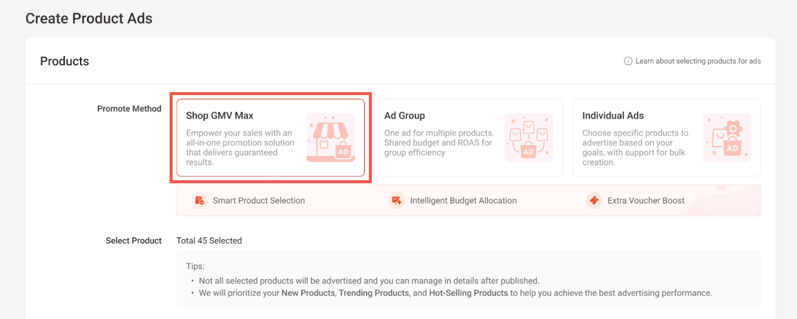
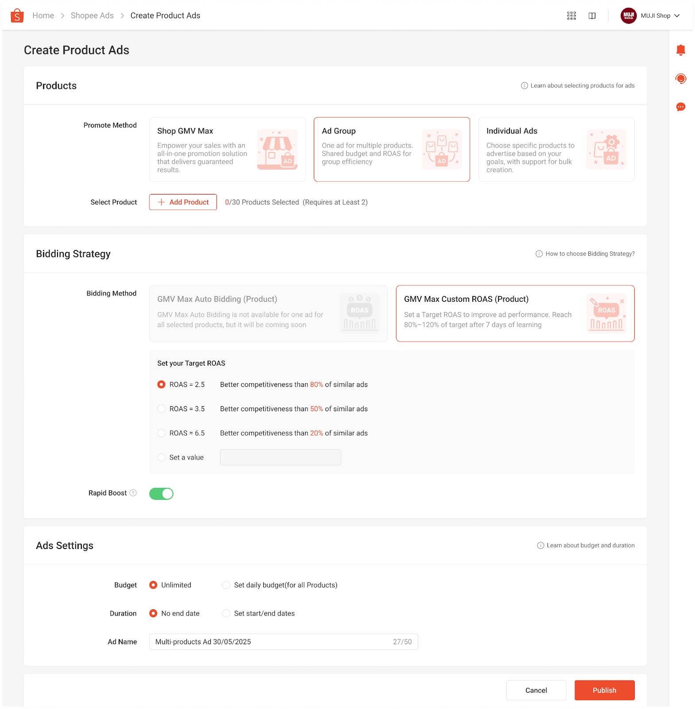
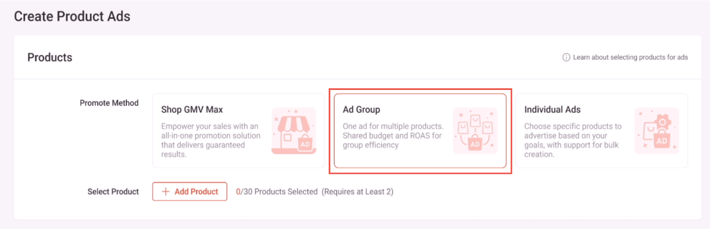

# 更新：Product Ads 创建页面布局改版与 Shop GMV Max 更名

> **来源：** https://ads.shopee.com.my/learn/faq/78/2247
> **分类：** 用户指南

为了改善广告创建体验并提升广告活动效率，Shopee Ads 平台将对 Product Ads 创建页面布局实施重大更新。这些变更旨在解决现有工作流程中的限制，并为各种广告策略提供更清晰的价值主张。

**1. 自动解决方案更名**

"Automatically Select Product（自动选择商品）"功能已正式更名为"Shop GMV Max"。这一变更体现了战略定位的转变，将功能从基础的选品工具升级为覆盖全店的综合广告解决方案。Shop GMV Max 旨在通过一站式推广机制优化全店收入，并提供效果保障。

**2. 推广方式精简优化**

广告创建界面已重新构建，在选择商品之前优先选择"推广方式"。这确保工作流程与卖家的具体策略目标相契合。现在三种主要方式已清晰区分：

- **Shop GMV Max：** 全店自动化解决方案，实现最高效率。
- **Ad Group（广告组）：** 以共享预算和 ROAS 目标管理多个商品的方式，提升群组管理和数据汇总效率。
- **Individual Ads（单个广告）：** 对特定商品目标进行精细控制及批量创建。

**3. 广告组入口更突出**

Ad Group 此前归类于手动设置中，现已成为创建页面的主要推广方式之一。此更新明确了群组管理级别和单个商品广告之间的区别，帮助卖家更好地理解共享预算和群组效率的优势。

**4. 工作流程与价值主张优化**

先选择推广方式再选品的修订流程，使平台能够为多商品组合提供更相关的"捆绑建议"。此设计减少了创建过程中的不确定性，并确保每种广告类型（特别是全店解决方案）的策略优势能够清晰地传达给卖家。